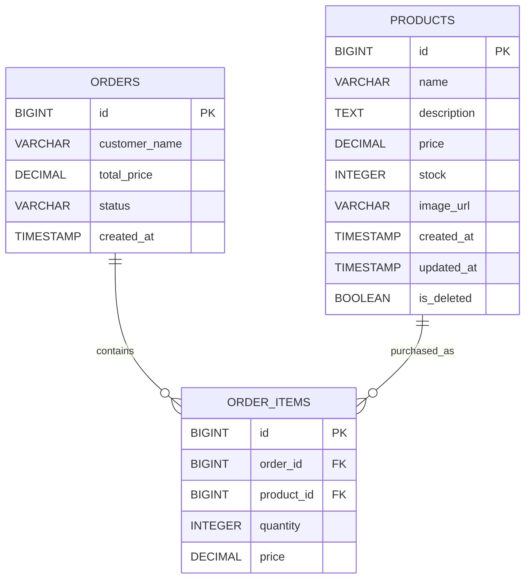

# Product Ordering System

This project is a fullstack solution for a simple product ordering system assessment. It is organized as a monorepo containing both the Spring Boot backend and the React frontend, connected through RESTful APIs and runnable with Docker Compose.

## Test Requirements Coverage

The project implements all required screens and workflows from the assessment:

### 1. Admin Product Management

Admins can manage products through a dedicated admin interface.

Implemented features:

- View product list
- View product information
- Add new products
- Edit existing products
- Delete products
- Upload product images
- Search and paginate products

### 2. User Product Listing and Order Creation

Users can browse available products and create orders from the frontend.

Implemented features:

- Product catalog page
- Product detail page
- Add to cart
- Stock-aware quantity handling
- Checkout form with customer name
- Order submission to the backend

### 3. Admin Order Management

Admins can view submitted orders from the admin dashboard.

Implemented features:

- View all orders
- View order details
- Display customer name, order status, total price, creation time, and ordered items

## Technical Highlights

- RESTful API architecture between frontend and backend
- DTO-based request and response handling
- Bean Validation for backend input validation
- Transactional order creation with stock validation
- Product stock deduction when orders are created
- Price snapshotting on order items, so historical order prices remain accurate
- Soft delete field available for products
- Product image upload using multipart form data
- Dockerized frontend, backend, and database
- Nginx serves the production frontend build with React Router fallback

## Tech Stack

### Backend

- Java 24
- Spring Boot 4.0.6
- Spring Web MVC
- Spring Data JPA
- Hibernate
- Bean Validation
- PostgreSQL 16
- Lombok
- Swagger / OpenAPI

### Frontend

- React
- Vite
- Tailwind CSS
- React Router DOM
- Axios
- Lucide React

### Infrastructure

- Docker
- Docker Compose
- Nginx
- PostgreSQL

## Project Structure

```text
ordersystem/
  backend/
    Dockerfile
    build.gradle
    src/
  frontend/
    Dockerfile
    nginx.conf
    package.json
    src/
  docker-compose.yml
  README.md
```

## Database Schema ERD



## Running the Project with Docker

Make sure Docker is installed and running on your machine.

From the project root, run:

```bash
docker compose up --build
```

After the containers start, open:

- Frontend: http://localhost:5173
- Backend API: http://localhost:8080
- Swagger UI: http://localhost:8080/swagger-ui/index.html
- PostgreSQL: localhost:5432

Default database configuration:

```text
Database: order_system_db
Username: admin
Password: password123
```

## API Overview

### Product APIs

```http
GET    /api/products?page={page}&size={size}&keyword={keyword}
GET    /api/products/{id}
POST   /api/products
PUT    /api/products/{id}
DELETE /api/products/{id}
POST   /api/products/upload-image
```

Product create/update payload:

```json
{
  "name": "Product name",
  "description": "Product description",
  "price": 10.99,
  "stock": 20,
  "imageUrl": "/uploads/example.jpg"
}
```

### Order APIs

```http
POST /api/orders
GET  /api/orders
GET  /api/orders/{id}
```

Order creation payload:

```json
{
  "customerName": "John Doe",
  "items": [
    {
      "productId": 1,
      "quantity": 2
    }
  ]
}
```

## Running Locally Without Docker

### Backend

Start PostgreSQL first, then run:

```bash
cd backend
./gradlew bootRun
```

On Windows:

```bash
cd backend
gradlew.bat bootRun
```

### Frontend

```bash
cd frontend
npm install
npm run dev
```

The frontend expects the backend to be available at:

```text
http://localhost:8080
```

## Notes

- The frontend is exposed on port `5173` in Docker Compose to match the backend CORS configuration.
- Uploaded product images are stored in a Docker volume named `backend_uploads`.
- PostgreSQL data is stored in a Docker volume named `postgres_data`.
- The first Docker build can take a few minutes because dependencies and base images need to be downloaded.
